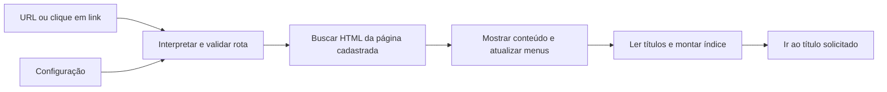

# Arquitetura proposta e atualização das instalações

Status atualizado em 2026-10-07: a separação entre tema, exemplos e instalação, as URLs de títulos e o índice automático estão implementados. O carregamento é centralizado em `js/load-site.js`, iniciado por `js/main.js`. Catálogo visual, adaptação completa ao celular e integração corporativa continuam pendentes. O [guia de uso](GUIA-DE-USO.md) descreve o comportamento atual e a migração.

## 1. Separar responsabilidades

A ideia de tema reutilizável faz sentido. Pense em um livro: o tema é o formato de impressão; a instalação contém os capítulos. Atualizar a tipografia não deveria reescrever um capítulo.

| Parte                | Responsabilidade                                          | Quem mantém                     |
| -------------------- | --------------------------------------------------------- | ------------------------------- |
| Tema genérico        | Navegação, URLs, índice, layout, estilos e acessibilidade | Mantenedor deste repositório    |
| Instalação           | Configuração, páginas, imagens e personalização           | Autor da wiki ou equipe usuária |
| Ambiente corporativo | Login, autorização, hospedagem, sessões e backups         | Equipe autorizada da empresa    |

HTML/CSS/JavaScript e os Web Components atuais são suficientes para o leitor do MVP. Banco de dados e framework não são pré-requisitos. O editor visual futuro será uma expansão de produto: precisará definir armazenamento, revisões, permissões, recuperação e formato do conteúdo.

## 2. Organização implementada para a separação

```text
documentacao-page/
├── index.html                  # estrutura do tema
├── css/                        # estilos mantidos pelo tema
├── js/
│   ├── components/             # header, sidebar e índice
│   ├── main.js                 # inicialização e navegação atual
│   └── load-site.js            # seleção e validação da configuração
├── examples/                   # configuração e páginas fictícias versionadas
│   ├── config.js
│   ├── pages/
│   ├── assets/
│   └── custom.css
├── site/                       # instalação local, ignorada pelo Git do tema
│   ├── config.js
│   ├── pages/
│   ├── assets/
│   └── custom.css
├── docs/                       # documentação do desenvolvimento do tema
├── .gitignore
├── AGENTS.md
├── CHANGELOG.md
└── README.md
```

Na demonstração genérica, o tema carrega `examples/`. Se `site/config.js` existir, carrega `site/`. A inicialização resolve a fonte uma vez e fornece os mesmos dados para todos os componentes. Imports, caminhos das páginas e carregamento de CSS já foram adaptados.

O cadastro diário continua simples: editar `site/config.js` e criar `site/pages/minha-pagina.html`. Imagens são arquivos adicionais de conteúdo, quando necessárias. Alterações de marca podem ficar na configuração e no CSS local.

A área `site/` é uma escolha simples para aprender e usar `pull`. Em ambientes com maior exigência, a configuração de hospedagem pode montar conteúdo de uma pasta externa ao checkout do tema. O serviço empresarial e seus segredos ficam fora da raiz estática pública e fora do repositório genérico.

**Contrato importante:** o tema nunca deve passar a rastrear arquivos em `site/`. O `.gitignore` não bloqueia acesso por navegador, ferramentas de IA, cópias manuais ou publicações. Também não altera arquivos que já estão rastreados. [Comportamento documentado pelo Git](https://git-scm.com/docs/gitignore).

O marcador de instalação é `site/config.js`: somente uma resposta HTTP 404 nesse endereço seleciona os exemplos. Um arquivo local inválido ou uma falha de conexão/acesso exibe erro e não ativa a demonstração. O servidor deve entregar arquivos reais e respostas 404 corretas, sem redirecionar essa requisição para `index.html` com status 200. Uma pasta `site/` sem `config.js` ainda não constitui uma instalação ativa.

## 3. Configuração como catálogo único

No MVP estático, o navegador não tem uma API geral para descobrir todos os arquivos de uma pasta publicada. A lista de páginas deve vir do `config.js`. A automação pretendida é: **cadastrou no config + criou o HTML → menus e índice aparecem automaticamente**.

Se futuramente quisermos “jogar um arquivo na pasta e pronto”, um script de geração ou backend deverá produzir esse catálogo. Isso é outra etapa, não uma capacidade implícita do navegador.

Contrato proposto, ainda não implementado:

```js
export const appSettings = {
  siteTitle: "Wiki de exemplo",
  sidebarTitle: "Documentação",
};

export const docsConfig = [
  {
    id: "guias",
    title: "Guias",
    pages: [{ id: "instalacao", title: "Instalação", file: "instalacao.html", icon: "🛠️" }],
  },
];
```

`title` é o nome de exibição; `id` é o endereço estável; `file` é onde está o HTML. Essa separação permite trocar “Instalação” por “Como instalar” sem quebrar os links. Para migrar a configuração atual, podemos aceitar inicialmente a ausência de `page.id` e derivá-lo do nome do arquivo, preservando as URLs existentes.

Validar IDs únicos, campos obrigatórios, páginas da aba e nomes de arquivo permitidos. No primeiro MVP, nomes simples `.html` sem caminhos externos ou `..` são suficientes. Um validador local pode detectar arquivo ausente antes da publicação; o navegador também deve tratar a falha.

A versão do tema deve ter origem no tema, separada da identidade de cada instalação. Atualizar o tema não deve exigir trocar manualmente a versão em todo `site/config.js`.

## 4. Contrato de URLs

Recomendação: manter fragmentos de URL, compatíveis com hospedagem estática e com a base atual.

| Destino | Exemplo proposto                             | Comportamento                                                                     |
| ------- | -------------------------------------------- | --------------------------------------------------------------------------------- |
| Início  | `index.html`                                 | Primeira aba com página válida; estado vazio se não houver nenhuma                |
| Aba     | `index.html#guias`                           | Primeira página da aba; normalizar sem acrescentar uma entrada extra no histórico |
| Página  | `index.html#guias/instalacao`                | Abrir a página e destacar os menus                                                |
| Título  | `index.html#guias/instalacao/pre-requisitos` | Carregar a página e ir ao título                                                  |

As quatro formas da tabela estão implementadas. Usar apenas um `#`, porque ele delimita o fragmento inteiro.

“Rastreável” aqui significa que um link consegue reconstruir a seleção e o ponto de leitura. O fragmento não é enviado ao servidor em uma requisição HTTP; indexação por buscadores, auditoria de acessos e analytics são problemas separados. Para uma wiki pública focada em SEO, reavaliar geração estática e URLs por caminho no futuro.

Fluxo proposto:



Uma função de navegação deve coordenar essa sequência. Separar leitura da URL, resolução no catálogo e atualização da tela deixa o código testável sem criar muitas abstrações.

Regras de comportamento:

- Links do cabeçalho, lateral e índice têm `href` completo. Copiar link e abrir em nova aba devem funcionar.
- A URL é a fonte da seleção, inclusive na primeira abertura, F5 e Voltar/Avançar. Estado salvo pelo histórico pode ser auxiliar.
- Para esse roteamento por fragmento, usar uma estratégia consistente baseada em `hashchange` e uma leitura inicial. `pushState` e `replaceState` não disparam `hashchange`; se usados para normalização, chamar a atualização explicitamente. Evitar dois listeners que carreguem a mesma página em duplicidade. [MDN](https://developer.mozilla.org/en-US/docs/Web/API/Window/hashchange_event).
- Rota inválida mostra uma mensagem e um caminho de recuperação. Não buscar um arquivo construído diretamente da entrada arbitrária da URL.
- Título inexistente mantém a página legível e avisa que o trecho não foi encontrado.
- Trocar apenas de título não deve buscar e reconstruir a mesma página novamente.
- Uma resposta antiga não pode substituir a última navegação; usar cancelamento ou um identificador de requisição.
- A URL deve representar também uma tentativa que terminou em erro, permitindo recarregar ou compartilhar esse estado.
- Atualizar `document.title`, foco e seleção visual de forma coerente. Clicar em títulos gera histórico; rolar manualmente apenas destaca o índice no primeiro MVP.

## 5. Índice automático de títulos

Usar um `h1` como título principal e `h2`/`h3` como subseções. O componente lê apenas os títulos de `#main-content`, não os títulos do cabeçalho ou da lateral. A profundidade pode ser configurável posteriormente.

O índice deve preservar a ordem e os níveis. Preferir listas aninhadas com links e um rótulo como “Nesta página”. IDs explícitos no HTML devem ser preservados; gerar IDs quando estiverem ausentes:

| Título           | ID automático possível        |
| ---------------- | ----------------------------- |
| Pré-requisitos   | `pre-requisitos`              |
| Como começar?    | `como-comecar`                |
| Exemplo repetido | `exemplo`, depois `exemplo-2` |

Também detectar colisões com IDs já existentes, títulos vazios e nomes que fiquem vazios após normalização. IDs explícitos duplicados devem ser apontados na validação.

**Automático não significa imutável:** se o texto muda, um ID calculado pode mudar. Para um trecho já compartilhado, fixar `id="pre-requisitos"` no HTML e manter esse ID ao renomear o título. IDs de abas e páginas também devem permanecer estáveis. Se uma mudança for inevitável, documentar a migração e considerar aliases antigos.

Em telas largas, um painel `sticky` acompanha a leitura sem cobrir o texto. Em telas pequenas, usar um índice recolhível. Definir qual elemento rola, descontar eventual cabeçalho fixo e respeitar preferências de movimento reduzido. Não depender de um atraso arbitrário para achar o título: montar o índice depois que o HTML estiver inserido.

## 6. Estilos e contrato do HTML

O tema cuida de um único contêiner de leitura. As páginas de exemplo são fragmentos sem `<html>`, `<head>`, scripts ou contêiner duplicado. As instalações devem seguir o mesmo contrato.

`css/content.css` deve estilizar títulos, parágrafos, links, listas, citações, código, tabelas, imagens e detalhes expansíveis dentro da área de leitura. Classes de avisos e introduções complementam o HTML semântico. Uma página de exemplos serve de catálogo e teste visual.

Carregar o CSS da instalação depois do CSS do tema, usando variáveis para personalizações frequentes. Isso reduz conflitos de Git, mas ainda requer compatibilidade: renomear uma classe usada pelo CSS local pode quebrar o visual sem causar conflito textual. Documentar as classes e variáveis consideradas públicas.

## 7. Como receber atualizações sem misturar conteúdo

| Opção                                     | Avaliação para este projeto                                      |
| ----------------------------------------- | ---------------------------------------------------------------- |
| Copiar tudo e editar os mesmos arquivos   | Simples inicialmente, difícil de atualizar                       |
| “Use this template” do GitHub             | Cria outro projeto; não cria um canal automático de atualizações |
| Clonar o tema e manter instalação isolada | Recomendação para aprender e entregar este MVP                   |
| Distribuir tema como pacote ou submódulo  | Pode ajudar depois; exige mais domínio de ferramentas            |

Um repositório criado de template começa com histórico próprio, enquanto um fork mantém o histórico do original. O botão de template não implementa a experiência de atualização de temas do WordPress. [GitHub Docs](https://docs.github.com/en/repositories/creating-and-managing-repositories/creating-a-repository-from-a-template).

`clone` baixa um repositório; `commit` registra uma revisão local; `push` envia commits; `fetch` recebe referências; `pull` recebe e integra alterações. Receber atualizações não publica os documentos locais.

O fluxo a seguir usa a separação implementada em 2026-09-30, em uma cópia que não altera nem cria commits próprios no tema. Para uma cópia antiga, seguir primeiro a migração no guia de uso:

1. Clonar o repositório genérico preservando seu histórico.
2. Criar a instalação a partir dos exemplos, dentro de `site/`.
3. Garantir que conteúdo e backups ficam apenas nos locais autorizados. Se a política proíbe qualquer envio ao GitHub, nem um repositório privado é exceção automática.
4. Conferir `git ls-files site` (deve ficar vazio) e `git check-ignore -v site/config.js` (deve mostrar a regra). Isso confirma a organização no Git, não a confidencialidade da hospedagem.
5. Usar uma conta sem permissão de escrita no repositório genérico. Remover o destino local de push ou usar um hook pode prevenir acidentes, mas é contornável e não substitui permissões do servidor.
6. Manter backup de `site/` e do serviço corporativo fora do checkout, em armazenamento autorizado. Arquivos ignorados não aparecem no histórico do tema.

Para avaliar uma atualização na cópia de testes:

```sh
git status --short
git rev-parse HEAD
git fetch origin
git diff --stat HEAD origin/main
```

Guardar a revisão anterior, ler o changelog e a migração. Se houver alteração em arquivo do tema, resolver conscientemente antes de atualizar. Com o tema limpo e sem divergência:

```sh
git pull --ff-only origin main
```

`--ff-only` recusa integrar históricos divergentes. Ele não promete compatibilidade visual, não faz backup de `site/` e não torna seguras alterações locais em arquivos rastreados. [Git pull](https://git-scm.com/docs/git-pull).

Validar navegação, links antigos, índice e personalização antes de promover a revisão ao ambiente de uso. Quando houver releases, preferir uma versão testada: avaliar a tag/revisão em um checkout limpo de homologação e registrar exatamente qual foi instalada, em vez de atualizar produção diretamente para qualquer estado de `main`.

Para voltar atrás, reimplantar a revisão anterior e restaurar o conteúdo do backup se tiver ocorrido migração de dados. Não usar `reset --hard` ou `clean` como receita de atualização. Uma migração deve ter backup e reversão documentados.

**Não existe promessa séria de “nunca dar conflito”.** Podemos evitar que duas partes editem o mesmo arquivo e testar compatibilidade. Essa combinação é o que torna as atualizações previsíveis.

## 8. Instalação corporativa e login

Autenticação responde “quem é você?”. Autorização responde “você pode ler este documento?”. A entrega de arquivos deve verificar a permissão no servidor/gateway, incluindo acesso direto a páginas e anexos. [OWASP: autorização](https://cheatsheetseries.owasp.org/cheatsheets/Authorization_Cheat_Sheet.html).

Fluxo esperado:

```text
Navegador → servidor/gateway corporativo → valida sessão e permissão
                                         → entrega documento autorizado
```

A integração com a API da empresa depende de informações ainda desconhecidas: mecanismo oficial de login/SSO, sessão, expiração, perfis, hospedagem e política de acesso. O amigo deve obter esse contrato com a TI antes de implementar. Preferir a identidade existente da empresa quando disponível. Senhas e segredos não pertencem ao `config.js` enviado ao navegador.

A homologação deve incluir tentar abrir um HTML e um PDF diretamente, sem sessão, com sessão expirada e após logout. O servidor deve negar acesso. Também avaliar caches e indexadores conforme a política da empresa. Não publicar conteúdo confidencial numa hospedagem estática pública esperando que uma tela de login o proteja.

Manter a integração corporativa fora dos componentes genéricos reduz conflitos de atualização. Até esse controle existir e ser validado, testar somente com conteúdo fictício.

## 9. Decisões a registrar antes da primeira distribuição

- Licença e autoria dos exemplos do tema.
- Forma de hospedagem e base da URL, inclusive uso em subpastas.
- Política de versões, compatibilidade de configuração, classes e IDs.
- Quem testa e aprova uma versão em cada instalação.
- Onde ficam backups e como comprovar uma restauração.
- Na empresa: responsáveis por conteúdo, revisão periódica e controle de acesso.

Essas decisões podem ser registradas aqui com data e justificativa. Quando houver muitas, separar registros curtos de decisão; não é necessário criar uma estrutura complexa agora.
